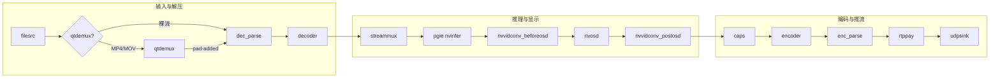

# deepstream_test1_rtsp_out Pipeline 数据流通路径

本文档描述 `deepstream_test1_rtsp_out.py` 中 GStreamer pipeline 的数据流向、各节点作用及数据格式。

---

## 1. 总览：两条入口路径

根据输入文件类型，**源到解析器**的路径不同，其余一致。

| 输入类型 | 入口路径 |
|----------|----------|
| **MP4 / MOV / M4V** | `filesrc` → `qtdemux` → *(pad-added 回调连接)* → `dec_parse` |
| **裸 H.264/H.265 流**（如 .h264/.265 或非容器） | `filesrc` → `dec_parse` |

从 `dec_parse` 到 `udpsink` 的路径**始终相同**。

---

## 2. 完整数据流（ASCII）

```
┌─────────────────────────────────────────────────────────────────────────────────────────────┐
│  输入：视频文件 (H.264/H.265 或 MP4/MOV 容器)                                                  │
└─────────────────────────────────────────────────────────────────────────────────────────────┘
                                          │
                                          ▼
┌──────────────┐     ┌──────────────┐     │
│  filesrc     │────▶│  qtdemux     │     │  （仅 MP4/MOV/M4V 时存在；裸流则 filesrc 直连 dec_parse）
│  文件源      │     │  解复用      │     │
└──────────────┘     └──────┬───────┘     │
       │                    │ pad-added   │
       │                    ▼             │
       │             ┌──────────────┐     │
       └────────────▶│  dec_parse   │◀────┘
                     │  h264/h265   │  数据：压缩码流 (video/x-h264 或 video/x-h265)
                     │  parse       │
                     └──────┬───────┘
                            │
                            ▼
                     ┌──────────────┐
                     │  decoder     │  出：video/x-raw(memory:NVMM), NV12
                     │  nvv4l2dec   │
                     └──────┬───────┘
                            │
                            ▼
                     ┌──────────────┐
                     │  streammux   │  批处理(batch-size=1)，出：batched NV12 (NVMM)
                     │  nvstreammux │
                     └──────┬───────┘
                            │
                            ▼
                     ┌──────────────┐
                     │  pgie        │  推理，附加 NvDsFrameMeta / NvDsObjectMeta
                     │  nvinfer     │  出：仍为 NV12 (NVMM) + 元数据
                     └──────┬───────┘
                            │
                            ▼
                     ┌──────────────────┐
                     │ nvvidconv_       │  NV12 → RGBA (NVMM)，供 OSD 画框/文字
                     │ beforeosd        │
                     └──────┬───────────┘
                            │
                            ▼
                     ┌──────────────┐
                     │  nvosd       │  在帧上画检测框、文字；Probe 在此读取/写入 display_meta
                     │  nvdsosd     │  出：RGBA (NVMM)
                     └──────┬───────┘
                            │
                            ▼
                     ┌──────────────────┐
                     │ nvvidconv_       │  RGBA → I420 (NVMM 或 x-raw)，供编码器
                     │ postosd          │
                     └──────┬───────────┘
                            │
                            ▼
                     ┌──────────────┐
                     │  caps        │  固定格式：video/x-raw(memory:NVMM), format=I420（或 x-raw I420）
                     │  capsfilter  │
                     └──────┬───────┘
                            │
                            ▼
                     ┌──────────────┐
                     │  encoder     │  出：video/x-h264 或 video/x-h265（压缩码流）
                     │  nvv4l2/x264  │
                     └──────┬───────┘
                            │
                            ▼
                     ┌──────────────┐
                     │  enc_parse   │  在码流中插入 SPS/PPS(VPS)，便于 RTP 发送
                     │  h264/h265   │
                     └──────┬───────┘
                            │
                            ▼
                     ┌──────────────┐
                     │  rtppay      │  封装为 RTP 包 (application/x-rtp)
                     │  rtph264/265 │
                     └──────┬───────┘
                            │
                            ▼
                     ┌──────────────┐
                     │  udpsink     │  组播 224.224.255.255:5400
                     └──────────────┘
```

---

## 3. Mermaid 流程图（按阶段分组）



---

## 4. 各阶段数据格式与注释

| 阶段 | 元素 | 输入数据格式 | 输出数据格式 | 说明 |
|------|------|----------------|----------------|------|
| **源** | `filesrc` | — | 文件字节流 | `location` 指定路径；MP4 或裸 H.264/H.265 均可。 |
| **解复用** | `qtdemux` | MP4/MOV 容器 | 按轨输出（如 video_0） | 仅当 `stream_path` 为 .mp4/.mov/.m4v 时存在；通过 `pad-added` 将 video pad 连到 `dec_parse`。 |
| **解析** | `dec_parse` (h264parse/h265parse) | 压缩码流（容器内或裸） | video/x-h264 或 video/x-h265，NAL 边界明确 | 定 NAL 边界、设 caps，供解码器使用。 |
| **解码** | `decoder` (nvv4l2decoder) | video/x-h264 或 x-h265 | video/x-raw(memory:NVMM), format=NV12 | 硬件解码，输出在 GPU 内存。 |
| **批处理** | `streammux` (nvstreammux) | 单路 raw NVMM | 批 raw NVMM (batch-size=1) | 为多路/批推理准备；此处单路。 |
| **推理** | `pgie` (nvinfer) | 批 raw NVMM | 同格式 + NvDsFrameMeta/NvDsObjectMeta | 检测框、类别等写入元数据。 |
| **格式转 OSD** | `nvvidconv_beforeosd` | NV12 (NVMM) | RGBA (NVMM) | nvosd 需要 RGBA 画框/文字。 |
| **OSD** | `nvosd` (nvdsosd) | RGBA (NVMM) | RGBA (NVMM) + display_meta | 在帧上绘制；sink pad 上挂 probe 读/写元数据。 |
| **格式转编码** | `nvvidconv_postosd` | RGBA (NVMM) | I420 (NVMM 或 x-raw) | 编码器输入一般为 I420。 |
| **固定格式** | `caps` (capsfilter) | 上游协商结果 | video/x-raw(memory:NVMM), format=I420（或 x-raw I420） | 硬件编码用 NVMM；软件编码用 x-raw。 |
| **编码** | `encoder` | I420 raw | video/x-h264 或 video/x-h265 | nvv4l2h264enc/nvv4l2h265enc 或 x264enc/x265enc。 |
| **编码后解析** | `enc_parse` (h264parse/h265parse) | 编码码流 | 同格式，SPS/PPS(VPS) 按 config-interval 插入 | 保证 RTP 接收端能拿到参数集。 |
| **RTP 封装** | `rtppay` (rtph264pay/rtph265pay) | 编码码流 | application/x-rtp | config-interval=1 定期发 SPS/PPS。 |
| **输出** | `udpsink` | RTP 包 | 组播 UDP 224.224.255.255:5400 | async=false, sync=1。 |

---

## 5. 分支与信号说明

### 5.1 是否使用 qtdemux

- **使用 qtdemux**：`stream_path` 以 `.mp4`、`.mov`、`.m4v` 结尾 → `source.link(demux)`，`demux.connect("pad-added", demux_pad_added_cb, dec_parse)`，在回调里把 `demux` 的 video pad 连到 `dec_parse`。
- **不使用**：其余情况 `source.link(dec_parse)`，文件按裸 H.264/H.265 流读入。

### 5.2 Probe 插入点

- **位置**：`nvosd` 的 **sink pad**。
- **类型**：`Gst.PadProbeType.BUFFER`。
- **作用**：每帧进入 OSD 前，从 `Gst.Buffer` 取 `NvDsBatchMeta` / `NvDsFrameMeta` / `NvDsObjectMeta`，生成 `NvDsDisplayMeta`（文字、框等）并 `nvds_add_display_meta_to_frame`，供 nvosd 绘制。

### 5.3 RTSP 服务（同进程）

- 本 pipeline 的 **udpsink** 向组播 224.224.255.255:5400 发 RTP。
- **GstRtspServer** 在同一进程内用 `udpsrc` 从该端口读 RTP，再通过 `rtsp://localhost:8554/ds-test` 提供给 RTSP 客户端。
- 即：**UDP 组播** 与 **RTSP 服务** 共用同一路编码输出，RTSP 是“再封装”给 RTSP 客户端用。

---

## 6. 一图总览（线性，含数据格式标注）

```
文件 ──▶ [qtdemux?] ──▶ dec_parse ──▶ decoder ──▶ streammux ──▶ pgie ──▶ nvvidconv ──▶ nvosd ──▶ nvvidconv ──▶ caps ──▶ encoder ──▶ enc_parse ──▶ rtppay ──▶ udpsink
         容器拆轨      码流解析       NV12(NVMM)    批NV12      推理+meta   NV12→RGBA   画OSD    RGBA→I420    I420     H.264/5    SPS/PPS    RTP     组播
```

---

## 7. 参考

- 源码：`deepstream_test1_rtsp_out.py`（`main()` 中 `pipeline.add` 与 `link` 顺序即数据流顺序）。
- 播放 UDP 组播：`ffplay -protocol_whitelist file,udp,rtp play_udp_h264.sdp`（或 play_udp_h265.sdp）。
- 播放 RTSP：`ffplay rtsp://127.0.0.1:8554/ds-test`。
