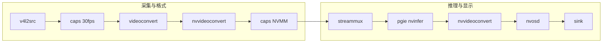

# deepstream_test_1_usb Pipeline 数据流通路径

本文档描述 `deepstream_test_1_usb.py`（USB 摄像头 + DeepStream 推理 + 本地显示）中 GStreamer pipeline 的数据流向、各节点作用及数据格式。

---

## 1. 总览

- **输入**：V4L2 设备（如 `/dev/video0`），常见输出格式为 YUYV 或 MJPEG。
- **输出**：本地显示（Jetson 用 `nv3dsink`，x86 用 `nveglglessink`）。
- **无编码/推流**：与 rtsp-out 示例不同，本示例只做「摄像头 → 推理 → OSD → 显示」。

---

## 2. 完整数据流（ASCII）

```
┌─────────────────────────────────────────────────────────────────────────────────────────────┐
│  输入：V4L2 设备（如 /dev/video0），常见格式 YUYV / MJPEG，多种帧率可选                      │
└─────────────────────────────────────────────────────────────────────────────────────────────┘
                                          │
                                          ▼
┌──────────────┐     ┌──────────────┐
│  v4l2src     │────▶│  caps_v4l2   │  约束：video/x-raw, framerate=30/1（避免协商到不想要的格式/帧率）
│  USB 摄像头   │     │  capsfilter  │
└──────────────┘     └──────┬───────┘
                            │  raw（多为 YUYV）
                            ▼
                     ┌──────────────┐
                     │  videoconvert│  软件转换：YUYV 等 → NV12/I420（系统内存）
                     │  vidconvsrc  │  nvvideoconvert 不接 YUYV，故必须先转
                     └──────┬───────┘
                            │  video/x-raw, format=NV12 或 I420
                            ▼
                     ┌──────────────┐
                     │ nvvideoconv  │  系统内存 raw → NVMM（GPU）raw，供 mux/infer
                     │ nvvidconvsrc │
                     └──────┬───────┘
                            │  video/x-raw(memory:NVMM)
                            ▼
                     ┌──────────────┐
                     │  caps_nvmm   │  固定 caps：video/x-raw(memory:NVMM)
                     │  capsfilter  │  保证进入 streammux 的已是 GPU 缓冲
                     └──────┬───────┘
                            │
                            ▼
                     ┌──────────────┐
                     │  streammux   │  批处理（batch-size=1），输出尺寸 1280x720
                     │  nvstreammux │
                     └──────┬───────┘
                            │  batched NV12 (NVMM)
                            ▼
                     ┌──────────────┐
                     │  pgie        │  推理，附加 NvDsFrameMeta / NvDsObjectMeta
                     │  nvinfer     │  出：仍为 NV12 (NVMM) + 元数据
                     └──────┬───────┘
                            │
                            ▼
                     ┌──────────────┐
                     │ nvvideoconv  │  NV12 (NVMM) → RGBA (NVMM)，供 nvosd 画框/文字
                     │  convertor   │
                     └──────┬───────┘
                            │
                            ▼
                     ┌──────────────┐
                     │  nvosd       │  在帧上画检测框、文字；Probe 挂在 sink pad 读/写 display_meta
                     │  nvdsosd     │  出：RGBA (NVMM)
                     └──────┬───────┘
                            │
                            ▼
                     ┌──────────────┐
                     │  sink       │  nv3dsink（Jetson）或 nveglglessink（x86），sync=false
                     │  显示        │
                     └──────────────┘
```

---

## 3. Mermaid 流程图



---

## 4. 各阶段数据格式与注释

| 阶段 | 元素 | 输入数据格式 | 输出数据格式 | 说明 |
|------|------|----------------|----------------|------|
| **源** | `v4l2src` | — | 摄像头原始输出（YUYV/MJPEG/NV12 等，由设备决定） | `device` 指定设备路径，如 `/dev/video0`。 |
| **约束帧率/类型** | `caps_v4l2src` | 上游任意 raw | video/x-raw, framerate=30/1 | 限制协商结果为 30fps、raw，避免选到 MJPEG 或其它帧率。 |
| **软件格式转换** | `videoconvert` (vidconvsrc) | 如 YUYV | NV12 或 I420（系统内存） | nvvideoconvert 不支持 YUYV；若摄像头已是 NV12 可 passthrough。 |
| **上 GPU** | `nvvideoconvert` (nvvidconvsrc) | 系统内存 raw | video/x-raw(memory:NVMM)，多为 NV12 | 转为 NvBufSurface（NVMM），供 streammux/nvinfer 使用。 |
| **固定 NVMM** | `caps_vidconvsrc` | 上游协商结果 | video/x-raw(memory:NVMM) | 保证进 streammux 的已是 GPU 缓冲。 |
| **批处理** | `streammux` | 单路 raw NVMM | 批 raw NVMM，1280×720，batch-size=1 | 单路时仍经 mux，统一尺寸与批格式。 |
| **推理** | `pgie` (nvinfer) | 批 NV12 (NVMM) | 同格式 + NvDsFrameMeta/NvDsObjectMeta | 检测结果写入元数据。 |
| **转 RGBA** | `nvvideoconvert` (convertor) | NV12 (NVMM) | RGBA (NVMM) | nvosd 需要 RGBA 画框/文字。 |
| **OSD** | `nvosd` (nvdsosd) | RGBA (NVMM) | RGBA (NVMM) + display_meta | 绘制框与文字；sink pad 上挂 buffer probe。 |
| **显示** | `sink` | RGBA (NVMM) | 屏幕 | Jetson：nv3dsink；x86：nveglglessink。sync=false 减少迟帧丢帧。 |

---

## 5. 分支与配置说明

### 5.1 为何 videoconvert → nvvideoconvert → capsfilter？

- **videoconvert**：USB 摄像头常出 YUYV，nvvideoconvert **不支持** YUYV，需先用软件转成 NV12/I420。
- **nvvideoconvert**：把系统内存的 raw 转为 **NVMM**，nvstreammux 与 nvinfer 只处理 GPU 缓冲。
- **caps_vidconvsrc**：显式固定为 `video/x-raw(memory:NVMM)`，避免下游误协商回系统内存。

### 5.2 为何两个 nvvideoconvert？

- **第一个**（nvvidconvsrc）：系统内存 raw → NVMM raw，给 **mux + 推理** 用。
- **第二个**（convertor）：NV12 (NVMM) → RGBA (NVMM)，给 **nvosd 和显示** 用（OSD 需要 RGBA）。

### 5.3 Sink 选择

- **Jetson（integrated GPU 或 aarch64）**：`nv3dsink`。
- **x86 等**：`nveglglessink`。  
  `sync=false` 避免因显示节奏导致迟帧被丢弃。

### 5.4 Probe 插入点

- **位置**：`nvosd` 的 **sink pad**。
- **类型**：`Gst.PadProbeType.BUFFER`。
- **作用**：每帧进入 OSD 前读取 NvDsBatchMeta/FrameMeta/ObjectMeta，生成 NvDsDisplayMeta（文字、框等），供 nvosd 绘制。

---

## 6. 一图总览（线性 + 数据格式）

```
v4l2src → caps(30fps) → videoconvert → nvvideoconvert → caps(NVMM) → streammux → pgie → nvvideoconvert → nvosd → sink
  摄像头    约束帧率      YUYV→NV12     raw→NVMM       批1280x720   推理+meta   NV12→RGBA   画OSD    显示
```

---

## 7. 参考

- 源码：`deepstream_test_1_usb.py`（`main()` 中 `pipeline.add` 与 `link` 顺序即数据流顺序）。
- 运行示例：`python3 deepstream_test_1_usb.py /dev/video0`。
