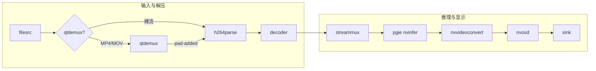

# deepstream_test_1 Pipeline 数据流通路径

本文档描述 `deepstream_test_1.py`（单路 H.264 文件 → 解码 → 推理 → OSD → 本地显示）中 GStreamer pipeline 的数据流向、各节点作用及数据格式。

---

## 1. 总览：两条入口路径

根据输入文件类型，**源到解析器**的路径不同，其余一致。

| 输入类型 | 入口路径 |
|----------|----------|
| **MP4 / MOV / M4V** | `filesrc` → `qtdemux` → *(pad-added 回调连接)* → `h264parser` |
| **裸 H.264 流**（如 .h264 或非容器） | `filesrc` → `h264parser` |

从 `h264parser` 到 `sink` 的路径**始终相同**。本示例**仅支持 H.264**（使用 h264parse），无 H.265 分支。

---

## 2. 完整数据流（ASCII）

```
┌─────────────────────────────────────────────────────────────────────────────────────────────┐
│  输入：视频文件（H.264 或 MP4/MOV 容器）                                                       │
└─────────────────────────────────────────────────────────────────────────────────────────────┘
                                          │
                                          ▼
┌──────────────┐     ┌──────────────┐     │
│  filesrc     │────▶│  qtdemux     │     │  （仅 MP4/MOV/M4V 时存在；裸流则 filesrc 直连 h264parser）
│  文件源      │     │  解复用      │     │
└──────────────┘     └──────┬───────┘     │
       │                    │ pad-added   │
       │                    ▼             │
       │             ┌──────────────┐     │
       └────────────▶│  h264parse   │◀────┘
                     │  H.264 解析  │  数据：压缩码流 (video/x-h264)，NAL 边界明确
                     └──────┬───────┘
                            │
                            ▼
                     ┌──────────────┐
                     │  decoder     │  出：video/x-raw(memory:NVMM), NV12
                     │  nvv4l2dec   │
                     └──────┬───────┘
                            │
                            ▼
                     ┌──────────────┐
                     │  streammux   │  批处理(batch-size=1)，1920×1080，出：batched NV12 (NVMM)
                     │  nvstreammux │
                     └──────┬───────┘
                            │
                            ▼
                     ┌──────────────┐
                     │  pgie        │  推理，附加 NvDsFrameMeta / NvDsObjectMeta
                     │  nvinfer     │  出：仍为 NV12 (NVMM) + 元数据
                     └──────┬───────┘
                            │
                            ▼
                     ┌──────────────┐
                     │ nvvideoconv  │  NV12 (NVMM) → RGBA (NVMM)，供 nvosd 画框/文字
                     │  nvconvertor │
                     └──────┬───────┘
                            │
                            ▼
                     ┌──────────────┐
                     │  nvosd       │  根据 ObjectMeta/DisplayMeta 画检测框、文字；Probe 在 sink pad
                     │  nvdsosd     │  出：RGBA (NVMM)
                     └──────┬───────┘
                            │
                            ▼
                     ┌──────────────┐
                     │  sink        │  nv3dsink（Jetson）或 nveglglessink（x86），本地显示
                     └──────────────┘
```

---

## 3. Mermaid 流程图



---

## 4. 各阶段数据格式与注释

| 阶段 | 元素 | 输入数据格式 | 输出数据格式 | 说明 |
|------|------|----------------|----------------|------|
| **源** | `filesrc` | — | 文件字节流 | `location` 指定路径；MP4 或裸 H.264 均可。 |
| **解复用** | `qtdemux` | MP4/MOV 容器 | 按轨输出（如 video_0） | 仅当输入为 .mp4/.mov/.m4v 时存在；通过 `pad-added` 将 video pad 连到 `h264parse`。 |
| **解析** | `h264parse` | 压缩码流（容器内或裸） | video/x-h264，NAL 边界明确 | 定 NAL 边界、设 caps，供解码器使用。 |
| **解码** | `decoder` (nvv4l2decoder) | video/x-h264 | video/x-raw(memory:NVMM), format=NV12 | 硬件解码，输出在 GPU 内存。 |
| **批处理** | `streammux` (nvstreammux) | 单路 raw NVMM | 批 raw NVMM，1920×1080，batch-size=1 | 为 nvinfer 准备批输入；此处单路。 |
| **推理** | `pgie` (nvinfer) | 批 raw NVMM | 同格式 + NvDsFrameMeta/NvDsObjectMeta | 检测框、类别等写入元数据。 |
| **格式转 OSD** | `nvvidconv` (nvvideoconvert) | NV12 (NVMM) | RGBA (NVMM) | nvosd 需要 RGBA 画框/文字。 |
| **OSD** | `nvosd` (nvdsosd) | RGBA (NVMM) | RGBA (NVMM) + 绘制结果 | 根据 ObjectMeta/DisplayMeta 绘制；sink pad 上挂 probe。 |
| **显示** | `sink` | RGBA (NVMM) | 屏幕 | Jetson：nv3dsink；x86：nveglglessink。 |

---

## 5. 分支与信号说明

### 5.1 是否使用 qtdemux

- **使用 qtdemux**：输入路径以 `.mp4`、`.mov`、`.m4v` 结尾 → `source.link(demux)`，`demux.connect("pad-added", demux_pad_added_cb, h264parser)`，在回调里把 `demux` 的 video pad 连到 `h264parser`。
- **不使用**：其余情况 `source.link(h264parser)`，文件按裸 H.264 流读入。

### 5.2 Probe 插入点

- **位置**：`nvosd` 的 **sink pad**。
- **类型**：`Gst.PadProbeType.BUFFER`。
- **作用**：每帧进入 OSD 前，从 `Gst.Buffer` 取 `NvDsBatchMeta` / `NvDsFrameMeta` / `NvDsObjectMeta`，生成 `NvDsDisplayMeta`（文字、框颜色等）并 `nvds_add_display_meta_to_frame`，供 nvosd 绘制。

### 5.3 Sink 选择

- **Jetson（integrated GPU 或 aarch64）**：`nv3dsink`。
- **x86 等**：`nveglglessink`。

### 5.4 与 rtsp-out / usbcam 的差异

- **无编码/推流**：仅本地显示，无 encoder、rtppay、udpsink。
- **仅 H.264**：只有 h264parse，无 h265parse 或按 codec 分支。
- **无 capsfilter**：解码后直接进 streammux，未显式约束 caps；OSD 前仅一个 nvvideoconvert（NV12→RGBA）。

---

## 6. 一图总览（线性 + 数据格式）

```
文件 ──▶ [qtdemux?] ──▶ h264parse ──▶ decoder ──▶ streammux ──▶ pgie ──▶ nvvideoconv ──▶ nvosd ──▶ sink
         容器拆轨      码流解析       NV12(NVMM)    批1920x1080   推理+meta   NV12→RGBA   画OSD    显示
```

---

## 7. 参考

- 源码：`deepstream_test_1.py`（`main()` 中 `pipeline.add` 与 `link` 顺序即数据流顺序）。
- 运行示例：`python3 deepstream_test_1.py <media file or uri>`，例如  
  `python3 deepstream_test_1.py /path/to/sample_1080p_h264.mp4`。
