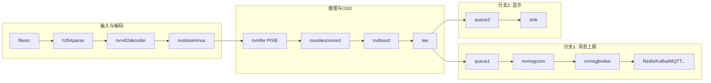

# deepstream_test_4 Pipeline 数据流通路径

本文档描述 `deepstream_test_4.py` 中 GStreamer pipeline 的数据流向与各阶段含义。

---

## 1. 总览（单路输入 + 推理 + 消息上报 + 显示）

```
                    ┌─────────────────────────────────────────────────────────────────┐
                    │                        Gst.Pipeline                              │
  ┌──────────┐      │                                                                  │
  │ H264文件  │      │  ┌─────────┐   ┌──────────┐   ┌─────────────┐   ┌───────────┐   │
  │(input_file)─────┼─►│ filesrc  │──►│ h264parse │──►│ nvv4l2decoder│──►│nvstreammux│   │
  └──────────┘      │  │file-source│   │h264-parser│   │nvv4l2-decoder│   │Stream-muxer│   │
                    │  └──────────┘   └───────────┘   └─────────────┘   └─────┬─────┘   │
                    │                                                         │        │
                    │         ┌───────────────────────────────────────────────┘        │
                    │         │  batch 解码帧 + 批元数据                                 │
                    │         ▼                                                        │
                    │  ┌─────────────┐   ┌──────────────┐   ┌─────────┐   ┌──────┐    │
                    │  │  nvinfer    │──►│nvvideoconvert │──►│ nvdsosd │──►│ tee  │    │
                    │  │primary-infer│   │  convertor    │   │ onscreendisplay│nvsink-tee│    │
                    │  └─────────────┘   └──────────────┘   └────┬────┘   └──┬───┘    │
                    │         ▲                                │           │         │
                    │         │  dstest4_pgie_config.txt       │ probe     │         │
                    │         │  (PGIE)                        │ 在此挂载   │         │
                    │         │                                │ 添加      │         │
                    │         │                                │ NvDsEventMsgMeta     │
                    │         │                                │           │         │
                    │         │           ┌────────────────────┴───────────┴─────┐   │
                    │         │           │                                      │   │
                    │         │     src_%u (tee_msg_pad)                   src_%u (tee_render_pad)
                    │         │           ▼                                      ▼   │
                    │         │  ┌────────────┐   ┌────────────┐   ┌────────────┐   │
                    │         │  │ queue      │──►│ nvmsgconv  │──►│ nvmsgbroker │   │
                    │         │  │ nvtee-que1 │   │nvmsg-conv  │   │ nvmsg-broker│   │
                    │         │  └────────────┘   └────────────┘   └──────┬─────┘   │
                    │         │        ▲                  ▲                    │     │
                    │         │        │                  │                    │     │
                    │         │   buffer+meta      payload (JSON)          Redis/    │
                    │         │                    dstest4_msgconv_config   Kafka/   │
                    │         │                                              MQTT等   │
                    │         │  ┌────────────┐                              │     │
                    │         │  │ queue      │──────────────────────────────┼──►  │
                    │         │  │ nvtee-que2 │                              │ 远端  │
                    │         │  └─────┬──────┘                              │ 消息  │
                    │         │        │                                    │ 服务  │
                    │         │        ▼                                    │     │
                    │         │  ┌────────────┐                              │     │
                    │         │  │ sink       │   (nveglglessink / nv3dsink / fakesink) │
                    │         │  │ 显示或丢弃  │◄─────────────────────────────┘     │
                    │         │  └────────────┘                                        │
                    │         │                                                        │
                    └─────────┼────────────────────────────────────────────────────────┘
                              │
```

---

## 2. 数据流分段说明

### 2.1 输入与解码段（Source → Mux）

| 顺序 | 元素名 (name)     | 类型           | 输入数据           | 输出数据           | 说明 |
|------|-------------------|----------------|--------------------|--------------------|------|
| 1    | file-source       | filesrc        | 无（从 location 读）| H.264 字节流       | 指定 `input_file` |
| 2    | h264-parser       | h264parse      | H.264 字节流       | 解析后的 H.264     | 出 caps 供解码器 |
| 3    | nvv4l2-decoder    | nvv4l2decoder  | H.264              | 解码后帧 (e.g. NV12) | 硬件解码 |
| 4    | Stream-muxer      | nvstreammux    | 解码帧 (sink_0)    | 批帧 + 批元数据    | 宽高 1920×1080，batch-size=1 |

- **链接**: `source → h264parser → decoder`；`decoder.src → streammux.sink_0`（动态 request pad）。

---

### 2.2 推理与显示预处理段（Mux → Tee）

| 顺序 | 元素名 (name)     | 类型      | 输入数据        | 输出数据        | 说明 |
|------|-------------------|-----------|-----------------|-----------------|------|
| 5    | primary-inference | nvinfer   | 批帧 + 批元数据 | 带 bbox/类别 的批元数据 | PGIE，配置 `dstest4_pgie_config.txt` |
| 6    | convertor         | nvvideoconvert | 同上         | 格式/布局转换后帧 | 为 OSD/显示准备 |
| 7    | onscreendisplay   | nvdsosd   | 帧 + 批元数据   | 画框/文字后的帧 + 元数据 | 在 nvosd **sink pad** 上挂 probe，每 30 帧为第一个目标挂 NvDsEventMsgMeta |
| 8    | nvsink-tee        | tee       | 同一 buffer     | 多路相同 buffer | 一路送消息链，一路送显示 |

- **链接**: `streammux → pgie → nvvidconv → nvosd → tee`。

---

### 2.3 Tee 分支一：元数据 → 消息转换 → 消息代理（上报）

| 顺序 | 元素名 (name) | 类型       | 输入数据              | 输出数据     | 说明 |
|------|---------------|------------|-----------------------|--------------|------|
| 9a   | nvtee-que1    | queue      | 带 NvDsEventMsgMeta 等的 buffer | 同上         | 解耦 tee 与下游 |
| 10a  | nvmsg-converter | nvmsgconv | 同上                  | 同 buffer，上挂 NvDsPayload（JSON） | 按 `dstest4_msgconv_config.txt`、schema_type 生成 payload |
| 11a  | nvmsg-broker  | nvmsgbroker | 带 NvDsPayload 的 buffer | 无（发送到远端） | proto-lib/conn-str/config，发到 Redis/Kafka/MQTT 等 |

- **链接**: `tee.request_pad("src_%u") → queue1.sink`；`queue1 → msgconv → msgbroker`。
- **数据形态**: 帧 + NvDsEventMsgMeta（含 bbox、trackingId、自定义 vehicle/person 等）→ NvDsPayload（JSON）→ 由 msgbroker 通过对应协议发到服务器。

---

### 2.4 Tee 分支二：显示（或丢弃）

| 顺序 | 元素名 (name) | 类型   | 输入数据 | 输出数据 | 说明 |
|------|---------------|--------|----------|----------|------|
| 9b   | nvtee-que2    | queue  | 与分支一相同的 buffer | 同上 | 解耦 |
| 10b  | sink          | nveglglessink / nv3dsink / fakesink | 带 OSD 的帧 | 无 | 根据平台与 `--no-display` 选择 |

- **链接**: `tee.request_pad("src_%u") → queue2.sink`；`queue2 → sink`。

---

## 3. 关键 Pad 与 Probe 位置

- **streammux 输入**: 使用 `request_pad_simple("sink_0")` 与 decoder 的 `src` 连接。
- **tee 输出**: 两个 `request_pad_simple("src_%u")`，分别连 queue1、queue2。
- **Probe 挂载点**: `nvosd.get_static_pad("sink")`，类型 `Gst.PadProbeType.BUFFER`；在 probe 里对每 30 帧的第一个目标挂 `NvDsEventMsgMeta`（含 NvDsVehicleObject / NvDsPersonObject 等），供后续 nvmsgconv 生成 payload。

---

## 4. Mermaid 流程图（简版）



---

## 5. 数据流小结

1. **一路 H.264 文件** → 解析 → 硬件解码 → **nvstreammux** 成批。
2. **批数据** 经 **nvinfer(PGIE)** 做检测，再经 **nvvideoconvert**、**nvdsosd** 画框；在 nvosd 的 sink pad 上 **probe 挂 NvDsEventMsgMeta**。
3. **tee** 把同一 buffer 分成两路：
   - **queue1 → nvmsgconv**：把 NvDsEventMsgMeta 转成 DeepStream Schema JSON（NvDsPayload）→ **nvmsgbroker** 发到远端。
   - **queue2 → sink**：本地显示或 fakesink 丢弃。

配置要点：PGIE 用 `dstest4_pgie_config.txt`，msgconv 用 `dstest4_msgconv_config.txt`，msgbroker 用 `-p` proto 库、`--conn-str`、`-c` 配置文件（如 cfg_redis.txt）等。
