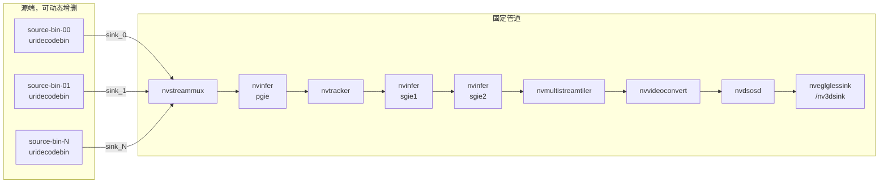

# deepstream_rt_src_add_del.py — Pipeline 数据流通路径

本文档描述示例中 GStreamer/DeepStream 管道的数据流向，便于理解动态添加/删除源时的数据路径。

---

## 1. 管道整体数据流（从左到右）

```
  ┌─────────────────────────────────────────────────────────────────────────────────────────────────────────┐
  │                                     Gst.Pipeline                                                         │
  │                                                                                                          │
  │   [源侧，可动态增删]                                                                                        │
  │   ┌──────────────┐   ┌──────────────┐        ┌──────────────┐                                             │
  │   │ source-bin-00│   │ source-bin-01│  ...   │ source-bin-N │   (uridecodebin，N ≤ MAX_NUM_SOURCES-1)     │
  │   │ uridecodebin │   │ uridecodebin │        │ uridecodebin │                                             │
  │   │ uri=file/rtsp│   │ uri=...      │        │ uri=...      │                                             │
  │   └──────┬───────┘   └──────┬───────┘        └──────┬───────┘                                             │
  │          │ video pad         │ video pad             │ video pad                                           │
  │          │ (pad-added 时     │ (cb_newpad 动态链接)  │                                                     │
  │          │  与 streammux     │                       │                                                     │
  │          │  sink_0..sink_N   │                       │                                                     │
  │          │  链接)            │                       │                                                     │
  │          ▼                  ▼                       ▼                                                     │
  │   ┌──────────────────────────────────────────────────────────┐                                           │
  │   │ nvstreammux (Stream-muxer)                                 │  ← 多路输入 sink_0, sink_1, ... 批成一路  │
  │   │ 输出: 批后的 buffer (batch)                                 │                                           │
  │   └──────────────────────────────────────────────────────────┘                                           │
  │          │                                                                                                │
  │          ▼                                                                                                │
  │   ┌──────────────────────────────────────────────────────────┐                                           │
  │   │ nvinfer (primary-inference, pgie)                         │  ← 主推理，目标检测等                      │
  │   └──────────────────────────────────────────────────────────┘                                           │
  │          │                                                                                                │
  │          ▼                                                                                                │
  │   ┌──────────────────────────────────────────────────────────┐                                           │
  │   │ nvtracker (tracker)                                       │  ← 多目标跟踪                             │
  │   └──────────────────────────────────────────────────────────┘                                           │
  │          │                                                                                                │
  │          ▼                                                                                                │
  │   ┌──────────────────────────────────────────────────────────┐                                           │
  │   │ nvinfer (sgie1, secondary1)                               │  ← 二级推理 1                             │
  │   └──────────────────────────────────────────────────────────┘                                           │
  │          │                                                                                                │
  │          ▼                                                                                                │
  │   ┌──────────────────────────────────────────────────────────┐                                           │
  │   │ nvinfer (sgie2, secondary2)                               │  ← 二级推理 2                             │
  │   └──────────────────────────────────────────────────────────┘                                           │
  │          │                                                                                                │
  │          ▼                                                                                                │
  │   ┌──────────────────────────────────────────────────────────┐                                           │
  │   │ nvmultistreamtiler (nvtiler)                              │  ← 多路拼成一块画面 (tile)                 │
  │   └──────────────────────────────────────────────────────────┘                                           │
  │          │                                                                                                │
  │          ▼                                                                                                │
  │   ┌──────────────────────────────────────────────────────────┐                                           │
  │   │ nvvideoconvert (convertor)                                │  ← 格式/分辨率转换                        │
  │   └──────────────────────────────────────────────────────────┘                                           │
  │          │                                                                                                │
  │          ▼                                                                                                │
  │   ┌──────────────────────────────────────────────────────────┐                                           │
  │   │ nvdsosd (onscreendisplay)                                 │  ← 在帧上画框/标签等 OSD                   │
  │   └──────────────────────────────────────────────────────────┘                                           │
  │          │                                                                                                │
  │          ▼                                                                                                │
  │   ┌──────────────────────────────────────────────────────────┐                                           │
  │   │ nveglglessink / nv3dsink (nvvideo-renderer)               │  ← 最终显示或输出                          │
  │   └──────────────────────────────────────────────────────────┘                                           │
  │                                                                                                          │
  └─────────────────────────────────────────────────────────────────────────────────────────────────────────┘
```

---

## 2. 各阶段数据与注释

| 阶段 | 元素 | 输入数据 | 输出数据 | 说明 |
|------|------|----------|----------|------|
| 1 | **source-bin-xx** (uridecodebin) | URI（文件/RTSP 等） | 解码后的视频 pad（如 raw 视频） | 每个 bin 一路源；`pad-added` 时在 `cb_newpad` 里与 streammux 的 `sink_%u` 动态链接。 |
| 2 | **nvstreammux** | 多路 raw 视频（sink_0, sink_1, …） | 批后的 GstBuffer（batch） | 多路合成一批，供后续 nvinfer 一次处理多路；源增删时通过 `request_pad_simple` / `release_request_pad` 增删 sink pad。 |
| 3 | **nvinfer (pgie)** | 批视频 + 元数据 | 带检测结果的批视频 + 元数据 | 主推理（如目标检测），batch-size = MAX_NUM_SOURCES。 |
| 4 | **nvtracker** | 带检测的批视频 | 带跟踪 ID 的批视频 | 为每个目标分配/维持 track ID。 |
| 5 | **nvinfer (sgie1)** | 带跟踪的批视频 | 带一级二级结果的批视频 | 二级推理 1（如分类等）。 |
| 6 | **nvinfer (sgie2)** | 同上 | 同上 | 二级推理 2。 |
| 7 | **nvmultistreamtiler** | 多路帧 | 单路合成后的帧（tile 布局） | 多路在单画面中分块显示。 |
| 8 | **nvvideoconvert** | 合成后的帧 | 格式/分辨率适配后的帧 | 供 OSD 与 sink 使用。 |
| 9 | **nvdsosd** | 帧 + 元数据 | 画好框/标签的帧 | 在帧上绘制检测框、标签等。 |
| 10 | **nveglglessink / nv3dsink** | 最终帧 | 显示/输出 | 根据平台选 EGL/3D sink。 |

---

## 3. 代码中的链接顺序（与数据流一致）

管道中显式/动态链接与数据流一一对应（见 `main()` 内）：

```text
# 动态链接（在 cb_newpad 中，每个 source bin 的 video pad → streammux）
uridecodebin (video pad)  ──link──►  streammux.request_pad_simple("sink_%u")

# 静态链接（main 中 streammux.link(...) 等）
streammux    ──►  pgie
pgie         ──►  tracker
tracker      ──►  sgie1
sgie1        ──►  sgie2
sgie2        ──►  tiler
tiler        ──►  nvvideoconvert
nvvideoconvert ──►  nvosd
nvosd        ──►  sink
```

---

## 4. Mermaid 流程图（可选渲染）



---

## 5. 动态增删源时数据流的变化

- **添加源**：新建一个 `uridecodebin`（source-bin-xx），加入 pipeline 并设为 PLAYING；其 `pad-added` 触发 `cb_newpad`，向 streammux 请求新的 `sink_%u` 并完成 link。此后该路数据从新 source bin 进入 streammux，参与同一套 pgie → tracker → sgie → tiler → osd → sink 的路径。
- **删除源**：对对应 source bin 执行 `set_state(NULL)`，向 streammux 的该路 sink pad 发 `flush_stop` 并 `release_request_pad`，再从 pipeline 中 remove 该 bin。该路不再向 streammux 送数据，其余路径不变。

整条数据流始终为：**多路源 → streammux → pgie → tracker → sgie1 → sgie2 → tiler → nvvideoconvert → nvosd → sink**；只有“进入 streammux 的源”的数量和 pad 会随动态添加/删除而变化。

---

*文档对应：`apps/runtime_source_add_delete/deepstream_rt_src_add_del.py`*
